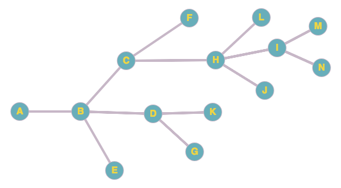

# AI CSP
CSP problem generator and solver for AI HW3

We have 14 courses from A to N and some of them are prerequisite for the others. 
All the professors in the department teach all courses but they have random knowledge in each course.
We aim to assign professors to courses so that:
* Course instructor has more than 80% knowledge in that course
* No professor teaches consecutive courses.

Courses prerequisites:
  


### Problem
We have between 10 to 30 courses and between 10 to 20 professors.
It is defined by the following in the first line of input:

```shell
12 8
```

Then number of edges in tree is mentioned:
```shell
11
```

After that courses prerequisites is defined by mentioning edges 
as a tuple of first course and second course with a space between.
Pay attention that each edge is just mentioned once(not for each node separately!)as a tuple of courses and knowledge with a space between.
```shell
0 3
0 9
0 11
1 5
2 3
4 9
5 8
5 10
6 10
7 10
7 11
```

After that each professor's knowledge is printed for all courses
 as a tuple of courses and knowledge with a space between.
```shell
0 80
1 87
2 79
3 71
4 50
5 97
6 54
7 70
8 65
9 85
10 63
11 79
0 73
1 65
2 60
3 75
4 74
5 96
6 95
7 94
8 99
9 85
10 54
11 79
0 81
1 79
2 88
3 96
4 65
5 80
6 99
7 72
8 76
9 79
10 68
11 98
0 62
1 97
2 55
3 80
4 81
5 69
6 66
7 66
8 100
9 61
10 94
11 67
0 52
1 99
2 71
3 67
4 80
5 57
6 59
7 63
8 54
9 85
10 98
11 88
0 82
1 72
2 63
3 50
4 98
5 85
6 90
7 91
8 88
9 54
10 82
11 90
0 54
1 96
2 81
3 98
4 55
5 71
6 80
7 70
8 100
9 68
10 90
11 95
0 64
1 67
2 82
3 72
4 98
5 50
6 74
7 56
8 77
9 97
10 66
11 73
```

